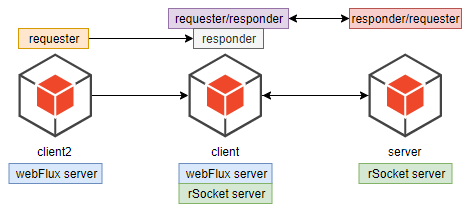

# Introduction
RSocket is a binary [protocol](https://github.com/rsocket/rsocket/blob/master/Protocol.md) for use on byte stream transports such as TCP, WebSockets, and Aeron.

It enables the following symmetric interaction models via async message passing over a single connection:

- request/response (stream of 1)
> This is probably the most common and familiar interaction model since HTTP also employs this type of communication.
>
> In this interaction model, the client initiates the communication and sends **a request**. Afterward, the server performs
 the operation and returns **a response** to the client – thus the communication completes.

- request/stream (finite stream of many)
> Request streaming is a more involved interaction model, where the client sends **a request** but gets **multiple 
 responses** over the course of time from the server.

- fire-and-forget (no response)
> As the name implies, the client sends **a request** to the server but **doesn't expect a response back**.

- channel (bi-directional streams)
> Send streams of messages in both directions.

All interaction models defined in **RSocket**.
 
# Architecture 


# Key Feature
- Four interaction models, handled with `@MessageMapping`
    - request/response (stream of 1)
    - request/stream (finite stream of many)
    - fire-and-forget (no response)
    - channel (bi-directional streams)
- Resume enhance
    - see more in [RSocketConfiguration](./client/src/main/java/com/shf/client/configuration/RSocketConfiguration.java) 
    and [RSocketServerConfiguration](./server/src/main/java/com/shf/server/configuration/RSocketServerConfiguration.java)
- RSocketStrategiesCustomizer enhance
- Metadata handle with `@Header` and `@Headers`
    - register different `MimeType` and `Class` by `metadataExtractorRegistry`
- Handle the placeholder in a destination template string
    - `@DestinationVariable`
- Handle the connection level payload included data and metadata with `@ConnectMapping`
    - match all connects
    - match the specific routes
- Switch the requester as a clientResponder by two different ways
    - see more in [RSocketConfiguration](./client/src/main/java/com/shf/client/configuration/RSocketConfiguration.java)
- Expose two ports in the same server for a webFlux server and a rSocket server
    - see more in [ClientApplication](./client/src/main/java/com/shf/client/ClientApplication.java)
- Integrate with spring-security for `basic authentication` and `authorization`
    - see more in [RSocketSecurityConfiguration](./client/src/main/java/com/shf/client/configuration/RSocketSecurityConfiguration.java)
- Graceful shutdown
- Lease

# Test Endpoints

## Four interaction models
### Request/Response 
```text
$ curl http://localhost:8080/user/1
```

### Request/Stream
```text
$ curl http://localhost:8080/user/
```

### Fire And Forget
```text
$ curl http://localhost:8080/user/add
```

### Request/Channel
```text
$ curl http://localhost:8080/user/request/channel
```

``
Another sample is the `pingpong` module. It implemented by rsocket native API. 
``

## Exception handler
```text
$ curl http://localhost:8080/user/error
{"id":-1,"name":null,"age":0}
```

## @DestinationVariable test
```text
$ curl http://localhost:8080/user/another/1
{"id":1,"name":"foo","age":18}
$ curl http://localhost:8080/user/another/2
{"id":2,"name":"bar","age":20}
```

## Metadata test
Customized metadata with different types, register them by `RSocketStrategiesCustomizer` and `MetadataExtractorRegistry`. 
Sample configuration is in the [RSocketServerConfiguration](./server/src/main/java/com/shf/server/configuration/RSocketServerConfiguration.java) class.
```text
$ curl http://localhost:8080/user/send/string/header
Your(foo) securityToken is 'bearer token_001' and refreshToken is 'refresh_token_001'

$ curl http://localhost:8080/user/send/headers

$ curl http://localhost:8080/user/send/entity/header
foo001

$ curl http://localhost:8080/user/send/map/header
[{name=car}, bar]

$ curl http://localhost:8080/user/send/json/header
foo001
```
> Notes: each mimeType can only be mapped a single name.

## @ConnectMapping test
Via the `@ConnectMapping` handler, we can control the Connect-Level authorization and collect all requesters(It's helpful when it is a broker).
More details in [UserController](./server/src/main/java/com/shf/server/controller/UserController.java)#allConnect 
and three requesters defined in [RSocketConfiguration](./client/src/main/java/com/shf/client/configuration/RSocketConfiguration.java).

Start the server and client in turn, logging as follows in the server console:
```text
c.shf.server.controller.UserController   : Default ConnectMapping, match all connect.Client_id: Client-123 . metadata: [connect-metadata-values, connect-metadata-values2]
c.shf.server.controller.UserController   : Specific ConnectMapping. Client_id:Client-234. metadata: [another-metadata-values]
c.shf.server.controller.UserController   : Default ConnectMapping, match all connect.Client_id: Client999 . metadata: [another-metadata-values]
c.shf.server.controller.UserController   : Client: Client-234 CONNECTED.
c.shf.server.controller.UserController   : Client: Client999 CONNECTED.
c.shf.server.controller.UserController   : Client: Client-123 CONNECTED.
c.shf.server.controller.UserController   : Reject client(Client999), disconnect.
c.shf.server.controller.UserController   : Client Client999 DISCONNECTED
```

## RequesterResponder
Here are two samples for showing how to use `RequesterResponder`, [Requester1ResponderController](./client/src/main/java/com/shf/client/responder/controller/Requester1ResponderController.java) and
[Requester2ResponderController](./client/src/main/java/com/shf/client/responder/controller/Requester2ResponderController.java) config in 
[RSocketConfiguration](./client/src/main/java/com/shf/client/configuration/RSocketConfiguration.java).

Test as follows:
```text
$ curl http://localhost:8080/user/requester1/responder
coco
$ curl http://localhost:8080/user/requester2/responder
coco
```

## Security

### valid user
```text
$ curl http://localhost:8000/user/1
{"id":1,"name":"宋海锋","age":100}
```

### role not match
```text
$ curl http://localhost:8000/user/role_not_match_authentication
{"timestamp":"2020-05-18T17:11:56.015+00:00","path":"/user/role_not_match_authentication","status":500,"error":"Internal Server Error","message":"","requestId":"82015050-5"}
```
logging from the `client2` console:
```text
io.rsocket.exceptions.ApplicationErrorException: Access Denied
```

### user mot match
```text
$ curl http://localhost:8000/user/user_not_authentication
{"timestamp":"2020-05-18T17:17:59.872+00:00","path":"/user/user_not_authentication","status":500,"error":"Internal Server Error","message":"","requestId":"4f1da4bc-6"}
```
logging from the `client2` console:
```text
io.rsocket.exceptions.ApplicationErrorException: Invalid Credentials
```


## Graceful shutdown
Since boot2.3.0, it supports graceful shutdown. First, config as folllows:
```text
# graceful shutdown setting
server.shutdown=graceful
spring.lifecycle.timeout-per-shutdown-phase=20s
# shutdown endpoint
management.endpoints.web.exposure.include=health,info,shutdown
management.endpoint.shutdown.enabled=true
```
Second, mocked an endpoint `/slow/handler` for test, it sleep 10s for test waiting. Last,
quick send three requests in turn for checking:
- Request a slow endpoint
```text
$ curl http://127.0.0.1:8080/user/slow/handler
```

- Shutdown `client-service` immediately
```text
$ curl -X POST "http://localhost:8080/actuator/shutdown"
```

-  Request a slow endpoint immediately
```text
$ curl http://127.0.0.1:8080/user/slow/handler
```
We will find that, the first request could be answered normally. The third request will be refused. The `client-service` real shutdown gracefully.

